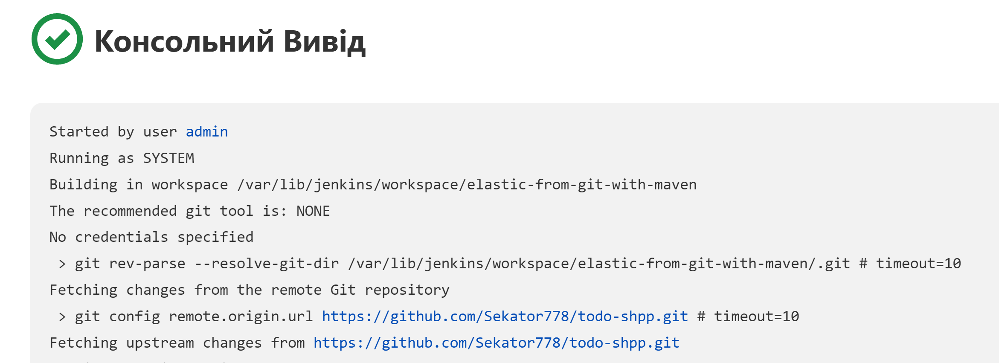

# todo-shpp

1. Create a CRUD REST API, for example a TODO list (what/when/status)
2. With auto-documentation and saving in in-memory/postgresql/mariadb
3. ToDo tasks must go through the states Planned -> Work_in_progress -> Done, Canceled Done and Canceled - final states, the direction of the state change is one-way.
4. Use an enum for the state, cover the state change logic with tests.
5. Deploy the API jar to your own AWS Elastic Beanstalk resource
6. Write shell scripts with API calls using curl
7. Add a couple of users with different roles and i18n to the API
8. Additionally: call HttpClient services of other students.
9. For example, log get /hello.
10. How is it possible to do something more - data synchronization between services.
11. Integration test and unit test supports
12. through a webhook, we start Jenkins on a remote server, which in turn collects the Maven project and deploys it to AWS Elastic Beanstalk
   [ current server ip](http://shpp-mentor.eu-west-2.elasticbeanstalk.com/)

for swagger use http://url:port/swagger-ui/index.html">...</a>

